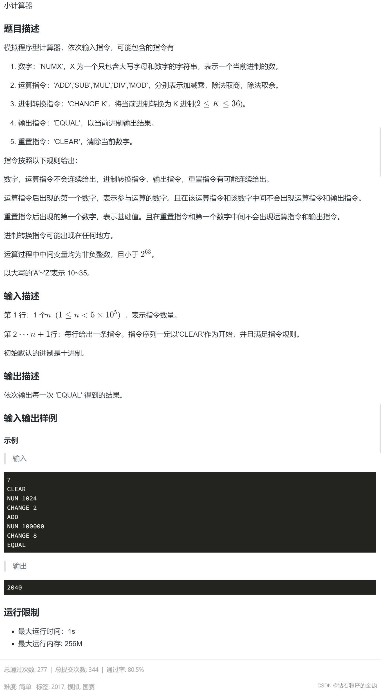

# 深入解析：蓝桥杯多进制计算器题目的Python实现

[[toc]]

## 简介

简述蓝桥杯题目的要求和这段代码的功能——一个支持多进制运算的计算器。

## 一、题目



## 二、代码概览

::: code-group

```python
import os
import sys

n = int(input())

def toDecimal(baseNumStr, baseNum):
    result = 0
    for char in baseNumStr:
        result = result * baseNum + int(char, base=36) 
    return result
    
def toAnyBaseNum(decimalNum, baseNum):
    if decimalNum == 0:
        return '0'
    digits = []
    while decimalNum:
        digits.append(str(decimalNum % baseNum) if decimalNum % baseNum < 10 else chr(ord('A') + decimalNum % baseNum - 10))
        decimalNum //= baseNum
    return ''.join(reversed(digits)) 

operations = {
    'ADD': lambda a, b: a + b,
    'SUB': lambda a, b: a - b,
    'MUL': lambda a, b: a * b,
    'DIV': lambda a, b: a // b,
    'MOD': lambda a, b: a % b,
}

result = 0
baseNum = 10
op = ''
for _ in range(n):
    s = input().split(maxsplit=1)
    cmd = s[0]
    arg = s[1] if len(s) > 1 else None

    if cmd == 'CLEAR':
        result = 0
        op = ''
    elif cmd == 'EQUAL':
        print(toAnyBaseNum(result, baseNum))
        op = ''
    elif cmd == 'CHANGE':
        baseNum = int(arg)
    elif cmd == 'NUM':
        num = toDecimal(arg, baseNum)
        result = num if not op else operations[op](result, num)
    else:
        op = cmd

```

:::

## 三、详细解析

### 1. 数制转换函数 `toDecimal`

::: code-group

```python
def toDecimal(baseNumStr, baseNum):
    result = 0
    for char in baseNumStr:
        result = result * baseNum + int(char, base=36)
    return result
```

:::

- 这个函数用于将一个字符串 `baseNumStr`（表示一个数），从其原始进制 `baseNum` 转换为十进制。
- `result` 初始化为 0，然后对 `baseNumStr` 中的每个字符进行遍历。
- 每个字符（代表一个数字）先被转换为十进制数，然后累加到 `result` 中，同时每次迭代都将 `result` 乘以基数 `baseNum`。
- 最终返回转换后的十进制数 `result`。

### 2. 数制转换函数 `toAnyBaseNum`

::: code-group

```python
def toAnyBaseNum(decimalNum, baseNum):
    if decimalNum == 0:
        return '0'
    digits = []
    while decimalNum:
        digits.append(str(decimalNum % baseNum) if decimalNum % baseNum < 10 else chr(ord('A') + decimalNum % baseNum - 10))
        decimalNum //= baseNum
    return ''.join(reversed(digits))
```

:::

- 这个函数将十进制数 `decimalNum` 转换为基数为 `baseNum` 的字符串表示。
- 如果 `decimalNum` 是 0，直接返回字符串 `'0'`。
- 使用 `digits` 列表收集转换后的每一位。
- 循环中，使用取模运算得到最低位，并根据结果是数字还是字母（对于大于9的值）添加到 `digits` 中。
- 除以基数 `baseNum` 准备下一次迭代。
- 最后，将 `digits` 中的元素反转并拼接成字符串。

### 3. 运算操作字典 `operations`

::: code-group

```python
operations = {
    'ADD': lambda a, b: a + b,
    'SUB': lambda a, b: a - b,
    'MUL': lambda a, b: a * b,
    'DIV': lambda a, b: a // b,
    'MOD': lambda a, b: a % b,
}
```

:::

- 一个字典，映射运算符字符串到相应的 lambda 函数。
- 每个 lambda 函数接受两个参数 `a` 和 `b`，并执行相应的运算。

### 4. 主循环

::: code-group

```python
result = 0
baseNum = 10
op = ''
for _ in range(n):
    s = input().split(maxsplit=1)
    cmd = s[0]
    arg = s[1] if len(s) > 1 else None

    # ...（命令处理逻辑）
```

:::

- 初始化 `result`（存储当前计算结果），`baseNum`（当前基数，默认为10），和 `op`（当前操作符）。
- 使用 `for` 循环读取 `n` 条命令。
- 每条命令通过 `input()` 读取，然后用 `split` 分割成命令和参数。

### 5. 命令处理逻辑

- **'CLEAR' 命令**：重置 `result` 和 `op`。
- **'EQUAL' 命令**：输出 `result` 的当前基数表示，重置 `op`。
- **'CHANGE' 命令**：改变当前基数 `baseNum`的进制。
- **'NUM' 命令**：
    - 如果没有当前操作符，将参数转换为十进制并存储到 `result`。
    - 如果有当前操作符，执行相应的运算并更新 `result`。
- **其他**：设置当前操作符。

## 四、技术细节

对于有一定编程基础但是对python还不够熟悉的小伙伴们，一定会对python中与C/C++代码不同的地方感到陌生，下面的内容我来为大家详细的解释一下

### 1. int(char, base=36)这玩意

在 Python 中，`int()` 函数可以用来将一个字符串转换为整数。当 `int()`
函数用于进制转换时，它可以接受两个参数：第一个参数是要转换的字符串，第二个参数是基数（base），表示当前数字的进制系统。

`int(char, base=36)` 这个表达式的作用是将字符串 `char` 从 36 进制转换为十进制数。在这里，`base=36` 表示该函数可以处理从 0
到 9 的数字和从 A 到 Z 的字母（总共 36 个符号）。每个字符都被视为一个单独的 36 进制数。

举例来说：

- 如果 `char` 是 `'1'`，则 `int('1', 36)` 返回 1。
- 如果 `char` 是 `'A'` 或 `'a'`，`int('A', 36)` 或 `int('a', 36)` 返回 10，因为在 36 进制中，'A' 或 'a' 表示 10。
- 如果 `char` 是 `'Z'` 或 `'z'`，`int('Z', 36)` 或 `int('z', 36)` 返回 35，这是 36 进制中的最大单个数值。

### 2. chr(ord('A') + decimalNum % baseNum - 10))这玩意

这个表达式用于将10到15的数字转换为对应的十六进制字符（'A'到'F'）。在许多进制转换中，当数字大于或等于10时，会使用字母来表示这些数值。

这个表达式是如何工作的：

1. **`ord('A')`**: 这是 Python 中的 `ord` 函数，它返回一个字符的 Unicode 码点。对于字符 'A'，它的码点是 65（这是 'A' 在
   Unicode 和 ASCII 编码中的数值）。
2. **`decimalNum % baseNum - 10`**: 这里 `decimalNum % baseNum` 是我们需要转换的数字，它的范围是10到15（对应十六进制中的 '
   A' 到 'F'）。`decimalNum % baseNum - 10` 将这个数值转换为0到5。这是因为我们希望10映射到0（因为'A'
   是从10开始的对应字符），11映射到1，依此类推。
3. **`ord('A') + decimalNum % baseNum - 10`**: 将 'A' 的码点与 `decimalNum % baseNum - 10`
   的结果相加。例如，如果 `decimalNum % baseNum` 是10（我们希望得到 'A'），`decimalNum % baseNum - 10`
   就是0，所以 `ord('A') + 0` 等于65，即 'A' 的码点。如果 `decimalNum % baseNum` 是11，`decimalNum % baseNum - 10`
   就是1，那么 `ord('A') + 1` 就是66，这是 'B' 的码点。
4. **`chr(...)`**: 最后，`chr` 函数将这个码点转换回对应的字符。所以，如果码点是65，`chr` 函数会返回 'A'；如果码点是66，`chr`
   函数会返回 'B'；依此类推。

### 3. ' '.join(reversed(digits))这玩意

用于将一个字符列表 `digits` 转换成一个字符串。这里，它用于创建数制转换的结果字符串。让我们分解这个表达式来更好地理解它：

1. **`digits`**：
    - 这是一个列表，其中的元素是字符串。这些字符串代表了一个数字在转换到另一进制时的各个位的值。
2. **`reversed(digits)`**：
    - `reversed` 是一个内置函数，用于反转序列（例如列表、字符串等）。在这里，它将 `digits` 列表中的元素顺序颠倒过来。
    - 数制转换时，通常从最低位开始计算，然后依次向高位进展。因此，转换完成时，最低位实际上位于列表的末尾。为了得到正确的顺序（即最高位在前），需要将列表反转。
3. **`''.join(...)`**：
    - `join` 是字符串类型的一个方法，用于将序列中的元素连接成一个字符串。这里的 `''`
      （空字符串）表示用来连接列表元素的分隔符。由于分隔符为空，因此列表中的元素将会直接相连，没有任何字符插入它们之间。
    - 例如，如果 `reversed(digits)` 的结果是 `['1', '2', '3']`，`''.join(reversed(digits))` 将会产生字符串 `'123'`。

总结来说，`''.join(reversed(digits))` 是一种常见的编程模式，用于将一系列的小片段组合成一个完整的字符串，同时保证顺序正确。这种方法在处理数字转换为字符串表示时尤其常见。

### 4.  'ADD': lambda a, b: a + b,这玩意

`lambda` 函数在 Python
中是一种创建小型匿名函数的方式。它的语法简单，主要用于需要一个函数的地方，但该函数又足够简单以至于不必单独定义。`lambda`
函数可以接受任意数量的参数，但只能有一个表达式，其计算结果就是这个函数的返回值。

`lambda` 函数的基本语法是：

::: code-group

```python
lambda arguments: expression
```

:::

这里，`arguments` 是传递给函数的参数，`expression` 是关于这些参数的表达式，其值作为函数的返回值。

在您的代码中，`lambda` 函数被用于创建简单的一行函数，以处理不同的数学运算：

::: code-group

```python
operations = {
    'ADD': lambda a, b: a + b,
    'SUB': lambda a, b: a - b,
    'MUL': lambda a, b: a * b,
    'DIV': lambda a, b: a // b,
    'MOD': lambda a, b: a % b,
}
```

:::

在这个 `operations` 字典中，每个键（如 'ADD', 'SUB' 等）都对应一个 `lambda` 函数作为其值。这些 `lambda` 函数接收两个参数 `a`
和 `b`，并执行相应的算术运算。

例如：

- `lambda a, b: a + b` 创建了一个匿名函数，它接受两个参数 `a` 和 `b` 并返回它们的和。
- `lambda a, b: a - b` 返回两个参数的差。

在主循环中，根据用户输入的运算符（存储在 `op` 变量中），从 `operations` 字典中选择相应的 `lambda` 函数，并调用它来执行计算：

::: code-group

```python
result = opCode(result, toDecimal(cmd[1], baseNum), op)
```

:::

这里的 `opCode` 函数实际上通过 `operations[op]` 获取相应的 `lambda` 函数，并用 `result` 和 `toDecimal(cmd[1], baseNum)`
作为参数来调用它。

使用 `lambda` 函数的这种方式使代码更加紧凑和易于理解，特别是在需要一系列简单函数时，这样可以避免定义许多几乎相同的小函数。

### 5. s = input().split(maxsplit=1)这玩意

在 Python 中，`input().split()` 方法用于将输入的字符串分割成子字符串，并返回这些子字符串的列表。当您为 `split()`
方法提供 `maxsplit` 参数时，它决定了分割操作的最大次数。下面详细解释 `s = input().split(maxsplit=1)` 这行代码的作用：

1. **方法功能**：`split()` 默认按照空白字符（如空格、换行符等）来分割字符串。如果没有指定分隔符，它将使用任何连续的空白字符作为分隔符。
2. **参数 `maxsplit=1`**：这个参数指定了分割操作的最大次数。在这里，`maxsplit=1` 表示最多分割一次。这意味着原始字符串 `s`
   将被分割成最多两个部分：在第一个空白字符处分割。
3. **结果**：如果原始字符串 `s` 中有空白字符，则 `split(maxsplit=1)`
   会在第一个空白字符处将其分割为两部分，并返回包含这两部分的列表。如果 `s` 中没有空白字符，或者空白字符在字符串的开头，那么返回的列表将只包含原始字符串本身。
4. **示例**：
    - 假设 `s = 'COMMAND arg1 arg2'`。在这种情况下，`s.split(maxsplit=1)` 会返回 `['COMMAND', 'arg1 arg2']`。
    - 如果 `s = 'COMMAND'`（没有空格），则返回 `['COMMAND']`。

### 6. operations[op](result, num)这玩意

这行代码使用了 Python 的条件表达式（也称为三元运算符）来决定 `result` 的值。让我们逐步解析这个表达式：

::: code-group

```python
result = num if not op else operations[op](result, num)
```

:::

1. **条件表达式结构**:
    - **条件部分**: `not op` —— 检查变量 `op`（存储当前操作符）是否为空。
    - **真值结果**: `num` —— 如果 `op` 为空（即没有待执行的操作符），则 `result` 被赋值为 `num`。
    - **假值结果**: `operations[op](result, num)` —— 如果 `op` 不为空，表达式执行字典 `operations` 中对应于 `op` 的
      lambda 函数，并传入 `result` 和 `num` 作为参数。
2. **操作逻辑**:
    - 当用户输入一个新数字且没有之前的操作符时（例如，刚刚输入了 'NUM' 命令），`op` 为空，所以 `result`
      设置为新输入的数字 `num`。
    - 如果之前已有操作符（如 'ADD', 'SUB' 等），则使用该操作符对应的函数（在 `operations` 字典中查找）来处理 `result`
      和 `num`。例如，如果 `op` 是 'ADD'，则调用 `operations['ADD'](result, num)`，它执行 `lambda a, b: a + b`
      ，即返回 `result + num` 的值。
3. **代码作用**:
    - 这行代码是计算器逻辑的核心，用于根据当前的操作符更新计算结果。
    - 它允许在不同命令之间保持状态，并根据新的输入和之前的操作进行适当的数学运算。

这种使用条件表达式的方式既紧凑又高效，特别适用于需要根据条件选择不同操作的场景。

## 总结

在这篇博客中，深入分析了一个多进制计算器的 Python
实现，涵盖了进制转换、算术运算处理及命令解析。通过详细解释每个函数和关键代码段，展示了如何有效地使用条件表达式、字典、`lambda`
函数等编程技巧。这个案例不仅加强了对基础编程概念的理解，也提供了实际问题解决方案的宝贵经验。

<div class="linkcard">
  <a href="https://vitepress.yiov.top/" target="_blank">
    <p class="description">Vitepress中文搭建教程<br><span>https://vitepress.yiov.top/</span></p>
    <div class="logo">
        
    </div>
  </a>
</div>
